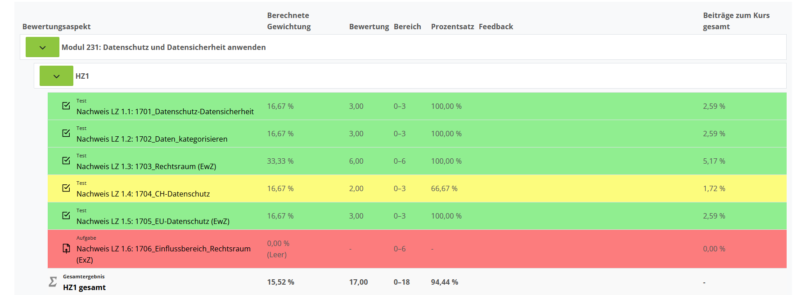

# potential Points

Dieses Script zeigt alle Tests in Moodle an die noch nicht die volle Punktzahl erzielt haben.

[install (GitHub)](https://github.com/BBBaden-Moodle-userscripts/potential-Points/raw/main/potential_points.user.js)

### Config

Wenn nötig kann man im Userscript Addon ein Wert hinzufügen um gewisse feature zu aktiviren und deaktivieren.

Im Userscript Addon ein Wert hinzufügen mit dem Namen "isGreenBackgroundEnabled". Der Wert wird auf auf true gesetzt wenn alle Aufgaben mit 100% grün angezeigt werden soll.
{
  "isGreenBackgroundEnabled": true
}

[mehr Info](https://github.com/black-backdoor/userscript-installation-guide/blob/main/additional-guide/violentmonkey-add-script-value.md)

### Values

- **isGreenBackgroundEnabled** (boolean)
- **isNothingShown** (boolean)

#### isGreenBackgroundEnabled
Sollen Einträge mit 100% der Punkten grün eingefärbt werden?

#### isNothingShown
Sollen Einträge ohne Werte Rot eingefärbt werden?
